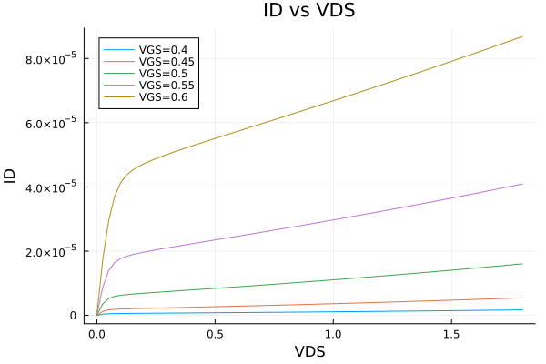

# Gm_ID_kit

Port from [Gm/ID Starter Kit](https://web.stanford.edu/~murmann/gmid)

[](https://Islam0mar.github.io/Gm_ID_kit.jl/stable/)
[](https://Islam0mar.github.io/Gm_ID_kit.jl/dev/)
[](https://github.com/Islam0mar/Gm_ID_kit.jl/actions/workflows/CI.yml?query=branch%3Amain)

## Examples

After loading `.mat` file.

```julia
using Gm_ID_kit
nch = ParseMAT(joinpath(dirname(pathof(Gm_ID_kit)), "..", "test", "180nch.mat"), "nch")
```
### LookUp
```julia
ID = LookUp(nch, "ID"; VGS = 0.6, L = 0.28)[1]
GM_CGG = LookUp(nch, "GM_CGG"; VGS = 0.6, L = 0.28)[1]
GM_CDD = LookUp(nch, "GM_CDD", "GM_ID", 15.0; VDS = 0.6, L = 0.28)[1]
```
### LookUpVGS
```julia
VGS = LookUpVGS(nch; GM_ID = 10, VDS = 0.6, VSB = 0.1, L = 0.18)[1]
VGS = LookUpVGS(nch; GM_ID = 10.0, VDB = 0.6, VGB = 1.0, L = 0.18)[1]
```
### Plot
```julia
# Plot ID versus VDS
vds = nch["VDS"]
vgs = collect(0.4:0.05:0.6)
ID = LookUp(nch, "ID"; VDS=vds, VGS=vgs)
plot(vds, ID[1,1,:,1], label="VGS=$(vgs[1])")
plot!(vds, ID[1,2,:,1], label="VGS=$(vgs[2])")
plot!(vds, ID[1,3,:,1], label="VGS=$(vgs[3])")
plot!(vds, ID[1,4,:,1], label="VGS=$(vgs[4])")
plot!(vds, ID[1,5,:,1], label="VGS=$(vgs[5])")
# plot!(legend=:outerbottom, legendcolumns=5)
title!("ID vs VDS")
xlabel!("VDS")
ylabel!("ID")
```



for more see tests.

## Motivation

To be used with [JuMP](https://github.com/jump-dev/JuMP.jl).

## TODO
 - [x] Refactor `LookUp` + unittest
 - [x] Refactor `LookUpVGS` + unittest
 - [ ] Rename to `GM_ID_Kit`
 - [ ] use Julia naming conventions
 - [ ] Optimization with JuMP
 - [ ] Extract LUTs from spice simulators
 - [ ] Generate .mat files or better file format!
 - [x] Add examples
 - [ ] Get rid of allocations

## Copyright
Original MATLAB code: Copyright (c) 2019 Boris Murmann (murmann@stanford.edu)

Test example is taken from `Analog/Mixed-Signal Simulation and Modeling` `Lab 04`: Copyright (c) 2022 Dr. Hesham Omran (Hesham.omran@eng.asu.edu.eg) 

Copyright (c) 2022 Islam Omar (io1131@fayoum.edu.eg)

<!---
### memory allocation
## using Profile
## using PProf
## Profile.Allocs.clear()
## @time Profile.Allocs.@profile sample_rate=1 LookUp(nch, "GM_GDS", "GM_ID", 8.0; VDS = 0.6)
## PProf.Allocs.pprof(from_c=false))

### Debugger
## using Debugger
## using JuliaInterpreter
## using MethodAnalysis
## visit(Base) do item
##   isa(item, Module) && push!(JuliaInterpreter.compiled_modules, item)
## true
## end
-->
